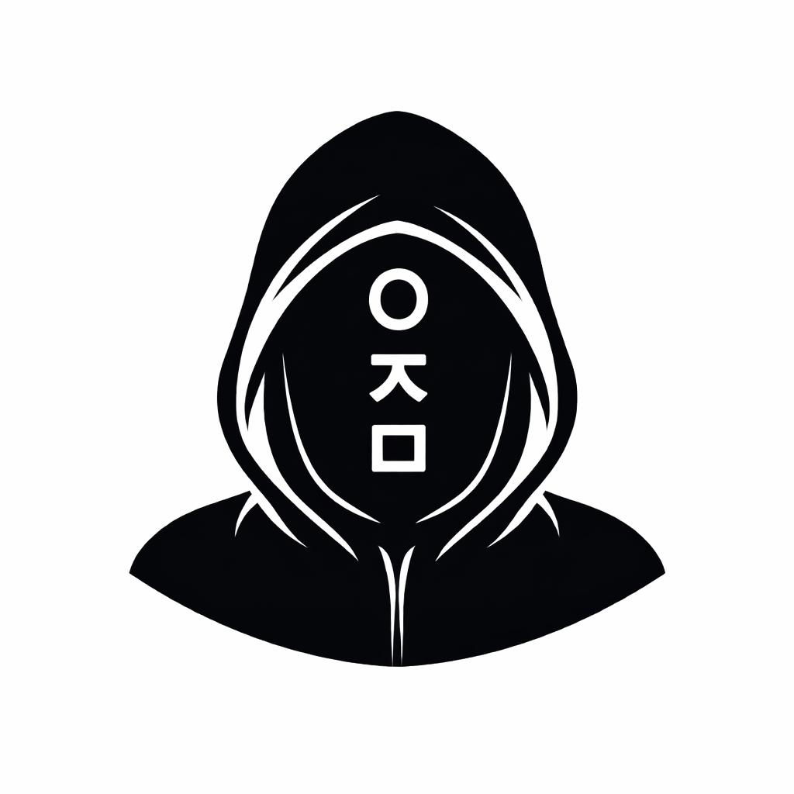
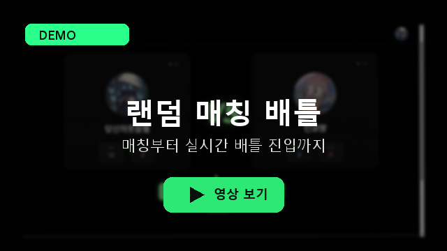
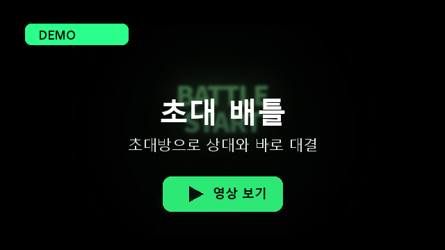
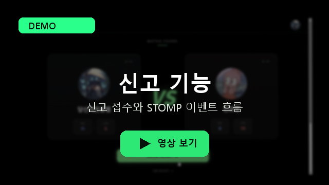
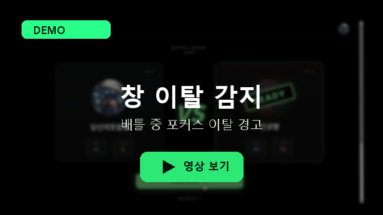
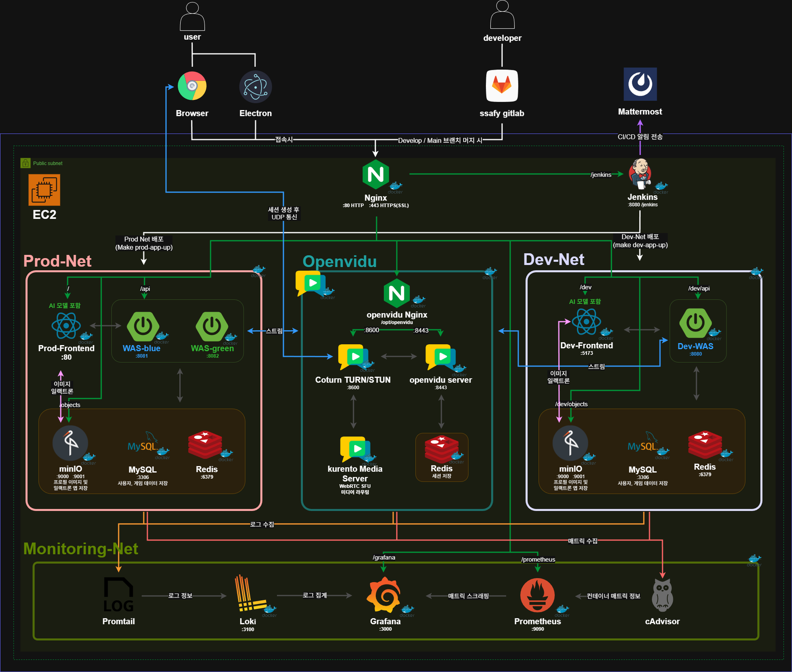

<div align="center">

# 웃지마게임



**미디어 스트림과 게임 이벤트를 분리하고, 브라우저 AI 웃음 판정과 Electron 검증 흐름을 결합한 실시간 웃음 참기 대결**

<br/>


</div>

---

## 기술 개요

'웃지마게임'은 사용자가 실시간 화상 대결에서 서로를 웃기고 웃음을 참는 서비스입니다. OpenVidu/WebRTC는 영상·음성 스트림에 집중하고, STOMP/SockJS/WebSocket은 준비, 턴 전환, 웃음 감지, 신고 같은 게임 이벤트를 별도로 동기화합니다. 브라우저에서 AI가 웃음을 확정하면 `REQUEST_LAUGHED` 이벤트가 서버로 전송되고, 서버가 턴/라운드/승패를 최종 처리합니다.

핵심은 실시간 미디어, 게임 판정, 운영 대응 흐름을 분리해 각 역할을 명확히 처리하는 것입니다.

| 흐름 | 담당 기술 | 역할 |
|------|-----------|------|
| 영상/음성 스트림 | OpenVidu, WebRTC | 참가자 간 저지연 화상 통화와 미디어 세션 연결 |
| 게임 상태 이벤트 | STOMP, SockJS, WebSocket | 준비, 시작, 턴 전환, 웃음 감지, 항복, 신고 이벤트 동기화 |
| 웃음 판정 | MediaPipe, ONNX Runtime Web, PyTorch/FastAPI | 브라우저 얼굴 탐지, 5프레임 시퀀스 기반 웃음 추론, 모델 학습/검증 |
| 방 보호와 운영 대응 | Electron, HMAC Signature, Report API, Google Sheets | Electron 전용 방 검증, 캡처 시도 경고, 신고 데이터 저장과 운영 기록 |
| 인증과 운영 안정성 | OAuth2, JWT, Redis, Jenkins, Nginx, Grafana/Loki/Promtail | 소셜 로그인, 토큰 재발급/회전, Blue/Green 배포와 로그 모니터링 |

---

## 핵심 기술 포인트

| 포인트 | 구현 방식 | 의미 |
|--------|-----------|------|
| 미디어와 게임 이벤트 분리 | OpenVidu/WebRTC는 영상·음성 스트림, STOMP/SockJS는 준비·턴·웃음·신고 이벤트 담당 | 화상 연결과 게임 규칙 처리를 독립적으로 다룸 |
| 브라우저 AI 웃음 판정 | MediaPipe Face Detector, `onnxruntime-web`, `smile_detector.onnx`, 5프레임 시퀀스, EMA/임계값 보정 | 서버 왕복 없이 클라이언트에서 웃음을 판정하고 확정 이벤트만 전송 |
| Electron 기반 방 보호 | `isElectronNeeded`, HMAC 기반 `X-Signature`/`X-Timestamp` 검증, Electron 사용 여부 표시 | Electron 전용 방 입장 기준과 캡처 경고 흐름 제공 |
| 신고와 운영 대응 | `POST /reports`, `REQUEST_REPORT`, DB 저장, Google Sheets 기록 | 게임 중 신고를 서비스 운영 데이터로 남김 |
| 인증 보안 | Kakao/Naver/Google OAuth, `registerToken`, Access Token, HttpOnly Refresh Cookie, Refresh Token Rotation | 소셜 로그인 이후 세션을 안전하게 유지 |
| 배포와 관측 | Jenkins, Nginx, Blue/Green, Grafana/Loki/Promtail | 배포 중단 시간을 줄이고 컨테이너 로그를 추적 |

AI 판정 흐름:

```text
MediaPipe 얼굴 탐지 -> ONNX 5프레임 추론 -> EMA/임계값 보정 -> REQUEST_LAUGHED -> 서버 턴/라운드/승패 처리
```

Electron 검증 흐름:

```text
Electron 앱 요청 -> X-Signature/X-Timestamp 전달 -> 서버 HMAC 검증 -> Electron 전용 방 생성/입장 허용
```

---

## 주요 기능

<table>
  <tr>
    <td align="center" valign="top" width="25%">
      <a href="docs/demo/videos/random-match.mp4">
        
      </a>
      <br />
      <a href="docs/demo/videos/random-match.mp4">
        
      </a>
      <br /><br />
      <strong>랜덤 매칭 배틀</strong>
      <p>랜덤 매칭 후 OpenVidu 화상 세션과 STOMP 게임 이벤트로 실시간 대결을 진행합니다.</p>
    </td>
    <td align="center" valign="top" width="25%">
      <a href="docs/demo/videos/invite-battle.mp4">
        
      </a>
      <br />
      <a href="docs/demo/videos/invite-battle.mp4">
        
      </a>
      <br /><br />
      <strong>초대 배틀</strong>
      <p>초대방으로 상대를 초대하고 준비/시작 흐름을 거쳐 배틀에 진입합니다.</p>
    </td>
    <td align="center" valign="top" width="25%">
      <a href="docs/demo/videos/report.mp4">
        
      </a>
      <br />
      <a href="docs/demo/videos/report.mp4">
        
      </a>
      <br /><br />
      <strong>신고 기능</strong>
      <p>신고 모달에서 사유를 접수하고 API 저장 및 STOMP 신고 이벤트로 대응합니다.</p>
    </td>
    <td align="center" valign="top" width="25%">
      <a href="docs/demo/videos/capture-guard.mp4">
        
      </a>
      <br />
      <a href="docs/demo/videos/capture-guard.mp4">
        
      </a>
      <br /><br />
      <strong>창 이탈 감지</strong>
      <p>배틀 중 포커스 이탈을 감지해 화면 가림과 경고 흐름을 제공합니다.</p>
    </td>
  </tr>
</table>

---

## 시스템 아키텍처

<p align="center">
  
</p>

| 영역 | 구성 | 역할 |
|------|------|------|
| Client | Browser, Electron App | React 앱 접속, Electron 전용 방 서명 헤더 전달, OpenVidu/STOMP 연결 |
| Edge | Nginx Reverse Proxy | `/api`, `/dev`, `/objects`, `/grafana`, `/api/webhook` 등 외부 진입 경로 중계 |
| Prod-Net | Prod-Frontend, WAS Blue/Green, MySQL, Redis, MinIO | 운영 서비스 실행, Blue/Green WAS 트래픽 전환, 사용자·게임 데이터와 이미지 저장 |
| Dev-Net | Dev-Frontend, Dev-WAS, MySQL, Redis, MinIO | 개발/검증 환경 실행, 운영과 분리된 API·정적 앱·데이터 스택 제공 |
| Realtime Media | OpenVidu, Kurento Media Server, Coturn, OpenVidu Redis | WebRTC 미디어 세션, TURN/STUN, OpenVidu 세션 상태 관리 |
| CI/CD | SSAFY GitLab, Jenkins, Mattermost | 브랜치 머지 기준 배포 파이프라인 실행, 배포 결과 알림 전송 |
| Monitoring-Net | Promtail, Loki, Grafana, Prometheus, cAdvisor | 컨테이너 로그 수집·조회, 메트릭 스크래핑, 운영 대시보드 제공 |

---

## 기술 스택

<table>
  <tr>
    <th align="center" width="20%">Category</th>
    <th align="center">Stack</th>
  </tr>
  <tr>
    <td align="center"><strong>Frontend</strong></td>
    <td>
      
      
      
      
      
      
    </td>
  </tr>
  <tr>
    <td align="center"><strong>Realtime</strong></td>
    <td>
      
      
      
      
    </td>
  </tr>
  <tr>
    <td align="center"><strong>AI / Vision</strong></td>
    <td>
      
      
      
      
      
      
    </td>
  </tr>
  <tr>
    <td align="center"><strong>Backend</strong></td>
    <td>
      
      
      
      
      
    </td>
  </tr>
  <tr>
    <td align="center"><strong>Data</strong></td>
    <td>
      
      
      
    </td>
  </tr>
  <tr>
    <td align="center"><strong>Infra</strong></td>
    <td>
      
      
      
      
      
      
    </td>
  </tr>
</table>

---

## 모듈별 역할

| 모듈 | 주요 역할 | 기술 키워드 |
|------|-----------|-------------|
| `frontend/` | 웹 클라이언트, OAuth 흐름, 매칭/방/대결 화면, OpenVidu 연결, 브라우저 웃음 감지, 캡처 경고 UI | React, TypeScript, Vite, Zustand, React Query, OpenVidu, ONNX Runtime Web |
| `backend/` | 인증, 사용자, 방 관리, 매칭, 게임 이벤트 처리, OpenVidu 토큰 발급, Electron 서명 검증, 신고 저장 | Java 21, Spring Boot, Spring Security, JPA, Redis, STOMP |
| `ai/smile-detection-ai/` | 웃음 감지 모델 학습/파인튜닝, ONNX export, FastAPI 분석 서버, 실험 리포트 | PyTorch, MediaPipe, OpenCV, FastAPI, MLflow, ONNX |
| `infra/` | Jenkins, Nginx, 데이터 서비스, 모니터링, 운영 네트워크 구성 | Docker Compose, Jenkins, Nginx, MySQL, Redis, MinIO, Grafana |
| `docs/` | API 명세, 시스템 아키텍처, 시연 자료 | API Spec, Demo, Architecture |
| `exec/` | 제출 및 포팅 산출물 | Porting, Deployment |

---

## 주요 API와 이벤트

| 영역 | 엔드포인트/채널 | 설명 |
|------|----------------|------|
| Auth | `/auth/login`, `/auth/regist`, `/auth/refresh`, `/oauth2/**` | OAuth 로그인, registerToken 기반 회원가입, JWT 재발급/회전 |
| User | `/user`, `/user/check/nickname`, `/user/upload/profileImage` | 사용자 정보, 닉네임 검사, 프로필 이미지 업로드 |
| Room | `/room/list`, `/room/create`, `/room/join`, `/room/join-by-code` | 방 목록, 방 생성, 일반/초대 입장 |
| Match | `/matchmaking/start`, `/matchmaking/cancel` | 랜덤 매칭 시작/취소 |
| Report | `/reports` | 신고 접수, DB 저장, Google Sheets 운영 기록 |
| Electron | `/is-electron`, `X-Signature`, `X-Timestamp` | Electron 앱 여부 확인과 Electron 전용 방 검증 |
| WebSocket | `/connect`, `/publish/{roomId}`, `/topic/**`, `/user/queue/**` | 준비, 시작, 턴 전환, `REQUEST_LAUGHED`, 항복, `REQUEST_REPORT` 이벤트 |
| OpenVidu Webhook | `/api/webhook` | OpenVidu 세션 이벤트 수신 및 방 상태 반영 |

---

## 저장소 구조와 라우팅맵

```text
.
├── frontend/                         # React 웹 클라이언트
│   ├── src/pages/                    # 랜딩, OAuth, 매칭, 방, 배틀, 다운로드 화면
│   ├── src/components/               # 공통 UI, Video, SmileCam
│   ├── src/services/                 # smileDetector 등 브라우저 AI 추론 로직
│   ├── src/hooks/                    # 캡처/포커스 감지 등 커스텀 훅
│   ├── src/stores/                   # Zustand 상태 관리
│   └── src/lib/                      # axios, queryClient
├── backend/                          # Spring Boot API 서버
│   ├── src/main/java/ssafy/E207/
│   │   ├── domain/                   # auth, user, match, game, report
│   │   └── global/                   # security, jwt, websocket, error, logging
│   └── docker-compose.*.yml          # 백엔드 로컬/개발/운영 실행 구성
├── ai/smile-detection-ai/            # 웃음 감지 모델 학습, ONNX export, FastAPI 서버
├── infra/                            # Jenkins, Nginx, DB/Redis/MinIO, monitoring
├── docs/                             # API, 기술 조사, 설계, 시연 자료
│   ├── demo/                         # README 주요 기능 시연 영상/썸네일
│   ├── img/                          # 시스템 아키텍처 이미지
│   └── {팀원명}/                     # 팀원별 기획/조사/기술 문서
├── exec/                             # 포팅 매뉴얼과 제출 산출물
├── scripts/                          # 배포 보조 스크립트
├── Makefile                          # 로컬/개발/운영 실행 진입점
├── DOCKER_GUIDE.md                   # Docker Compose 환경별 가이드
└── DEPLOYMENT_GUIDE.md               # Blue/Green 배포 및 운영 가이드
```

---

## 문서 바로가기

### Overview

| 문서 | 경로 |
|------|------|
| Frontend README | [frontend/README.md](frontend/README.md) |
| Backend README | [backend/README.md](backend/README.md) |
| Infra README | [infra/README.md](infra/README.md) |
| Docker Guide | [DOCKER_GUIDE.md](DOCKER_GUIDE.md) |
| Deployment Guide | [DEPLOYMENT_GUIDE.md](DEPLOYMENT_GUIDE.md) |
| Porting Manual | [exec/PORTING_MANUAL.md](exec/PORTING_MANUAL.md) |

### Architecture / API

| 문서 | 경로 |
|------|------|
| API 명세서 | [docs/API_SPEC.md](docs/API_SPEC.md) |
| OpenVidu Webhook 가이드 | [docs/OPENVIDU_WEBHOOK_GUIDE.md](docs/OPENVIDU_WEBHOOK_GUIDE.md) |

### AI

| 문서 | 경로 |
|------|------|
| AI 프로젝트 구조 | [ai/smile-detection-ai/docs/PROJECT_STRUCTURE.md](ai/smile-detection-ai/docs/PROJECT_STRUCTURE.md) |

### 실행 및 상세 안내

| 구분 | 안내 | 경로 |
|------|------|------|
| Frontend | 웹 클라이언트 실행 및 빌드 가이드 | [frontend/README.md](frontend/README.md) |
| Backend | 백엔드 실행 및 환경 변수 가이드 | [backend/README.md](backend/README.md) |
| Infra | 운영 인프라 구성 기준 | [infra/README.md](infra/README.md) |
| Docker | 로컬/개발/운영 Compose 실행 | [DOCKER_GUIDE.md](DOCKER_GUIDE.md) |
| Deploy | Blue/Green 배포 절차 | [DEPLOYMENT_GUIDE.md](DEPLOYMENT_GUIDE.md) |
| Jenkins | CI/CD 파이프라인 운영 | [JENKINS_GUIDE.md](JENKINS_GUIDE.md) |

---

## 실행 가이드

### 사전 요구사항

- Docker & Docker Compose
- Node.js 18+
- JDK 21
- Python 3.10+ (AI 서버 또는 학습 실행 시)

### 로컬 백엔드/데이터 스택 실행

```bash
make local-up
```

| 서비스 | URL |
|--------|-----|
| Backend API | http://localhost:8081 |
| Swagger UI | http://localhost:8081/swagger-ui/index.html |
| MySQL | localhost:3307 |
| Redis | localhost:6380 |
| MinIO Console | http://localhost:9001 |

### 프론트엔드 실행

```bash
cd frontend
npm install
npm run local
```

### AI API 서버 실행

```bash
cd ai/smile-detection-ai
pip install -r requirements.txt
uvicorn api.main:app --reload
```

### 로컬 스택 중지

```bash
make local-down
```

---

## 팀 소개 — 웃지마게임

<table>
  <tr>
    <td align="center" width="14%">
      <strong>이재호</strong><br/>
      <sub>팀장</sub><br/><br/>
      <br/>
      <br/>
      <br/>
      <sub>기획/일정 관리</sub><br/>
      <sub>문서·시연</sub>
    </td>
    <td align="center" width="14%">
      <strong>김승철</strong><br/>
      <sub>팀원</sub><br/><br/>
      <br/>
      <br/>
      <sub>OpenVidu 클라이언트</sub><br/>
      <sub>Battle UI</sub>
    </td>
    <td align="center" width="14%">
      <strong>박세홍</strong><br/>
      <sub>팀원</sub><br/><br/>
      <br/>
      <br/>
      <sub>배틀 화면</sub><br/>
      <sub>AI 판정 연동</sub>
    </td>
    <td align="center" width="14%">
      <strong>양한빈</strong><br/>
      <sub>팀원</sub><br/><br/>
      <br/>
      <br/>
      <sub>웃음 감지 모델</sub><br/>
      <sub>FastAPI</sub>
    </td>
    <td align="center" width="14%">
      <strong>오언서</strong><br/>
      <sub>팀원</sub><br/><br/>
      <br/>
      <br/>
      <br/>
      <sub>신고 API</sub><br/>
      <sub>캡처·포커스 감지</sub>
    </td>
    <td align="center" width="14%">
      <strong>유준호</strong><br/>
      <sub>팀원</sub><br/><br/>
      <br/>
      <br/>
      <br/>
      <sub>배포 자동화</sub><br/>
      <sub>Electron 배포 연결</sub>
    </td>
    <td align="center" width="14%">
      <strong>차경빈</strong><br/>
      <sub>팀원</sub><br/><br/>
      <br/>
      <br/>
      <br/>
      <sub>방/매칭 도메인</sub><br/>
      <sub>Electron 서명 검증</sub>
    </td>
  </tr>
</table>

---

## License

This project is for SSAFY educational purposes.
