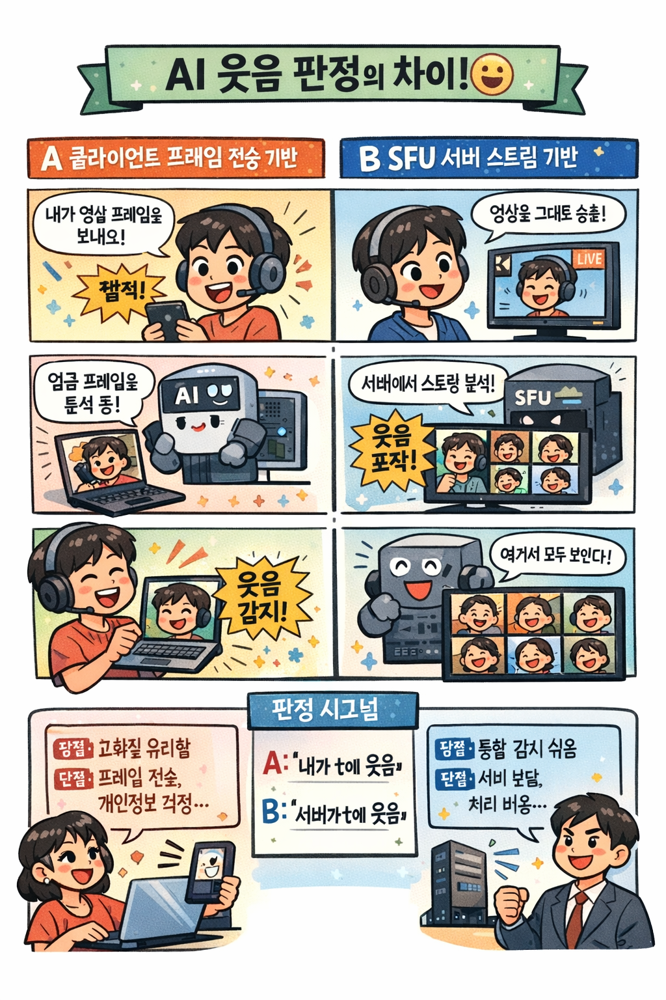

### 목차

- [1️⃣ 클라이언트 프레임 전송 기반 AI 판정](#1-------------------ai---)
- [2️⃣ SFU 스트림 기반 AI 판정](#2---sfu--------ai---)
- [🌟 SFU 를 더 선호하는 이유](#---sfu------------)
    + [회의 결과](#-----)

# 1️⃣ 클라이언트 프레임 전송 기반 AI 판정

- 각 클라이언트가 자신의 카메라 영상에서 저fps 로 프레임을 추출
- 이 프레임을 AI 서버로 전송
- AI 서버가 웃음 여부를 판단
- 서버에 이벤트 전송 → A 가 t 시점에웃음

특징

- AI 입력: 프레임(이미지)
- 판정 위치: 서버(중앙)
- 프레임 생성 주체: 클라이언트

장점

- 판정이 중앙화되어 일관성 있음
- 클라이언트 성능 편차 영향 ↓

단점

- 모든 클라이언트가 프레임 전송 필요
- 서버 부하/비용 증가

# 2️⃣ SFU 스트림 기반 AI 판정

- 클라이언트는 영상 스트림만 WebRTC 로 SFU 에 송출
- SFU 가 이미 수신 중인 스트림에서
    - 분석용 저화질/저fps 프레임을 추출
- AI 서버가 이 스트림을 분석
- 웃음 이벤트 생성 → A 가 t 시점에 웃음

특징

- AI 입력: 스트림에서 추출한 프레임
- 판정 위치: 서버(SFU/AI 서버)
- 프레임 생성 주체: SFU

장점

- 클라이언트 구현 단순
- 조작/치팅 어려움 → 공정성 ↑
- 판정 조건이 모두에게 동일

단점

- SFU/서버 구현 난이도 ↑
- 서버 연산 비용 ↑
- 영상이 서버에서 직접 처리됨 → 정책/동의 필요

# 🌟 SFU 를 더 선호하는 이유

1️⃣ 프레임 전송 시점이 사람마다 다름

클라이언트 프레임 전송 기반이면 시간이 꼬일 수 있다. 프레임 전송 시점이 사람마다 다르다. 예를 들어 A 는 5fps, B는 10fps, C 는 네트워크가 튕겨서 2fps 등이 될 수 있다. 따라서 같은 순간에 웃었는지를 서버가 보장할 수 없다.

2️⃣ 네트워크 지연이 전부 다름

A: 30ms, B:120ms, C: 순간적으로 500ms 가 될 수 있다. 이런 경우 서버 입장에서는 누가 먼저 웃은건지에 대한 판단이 애매해진다.

3️⃣ 클라이언트 시간은 신뢰할 수 없음

기기 시계가 다르고, JS 타이머 드리프트, 일부러 시간 조작 가능.

4️⃣ 프레임 누락은 무조건 발생

모바일 절전, 백그라운드 전환, 브라우저 탬 전환 등 때문에 웃었지만 프레임이 오지 않을 경우 판정 누락으로 이어질 수 있다.

물론, 서버 기준 타이머 신호 보내기, 서버 기준 timestamp 부여, 전송 FPS 강제 등을 통해 시간을 비슷하게 맞추는 시도는 가능하다. 하지만 완전히 같음을 보장할 수 없다.

따라서 클라이언트 프레임 기반은 개인 판정에는 서버 비용이 낮아져 적합할 수 있지만, 공정성이 중요한 게임에서는 SFU 데이터 프레임을 넘겨주는 것이 더 적합하다고 생각하였다.

### 회의 결과

위와 같이 확정하기 전 AI 모델 담당자와의 회의가 필수적이라고 생각하였다. 2026.01.16 스크럼 미팅 때 다음과 같은 사안을 말씀 드렸다. AI 서버가 여러 얼굴을 탐지하여 각 얼굴의 표정을 분석하는 것이 아니라, 1인으로 우선적으로 가정하고 표정을 탐지하여 모델 재구성이 필요하다는 답변을 얻었다. 이어, 더 나은 서비스를 만들기 위해 오후에 더 심도 깊은 회의를 가지기로 하였다.