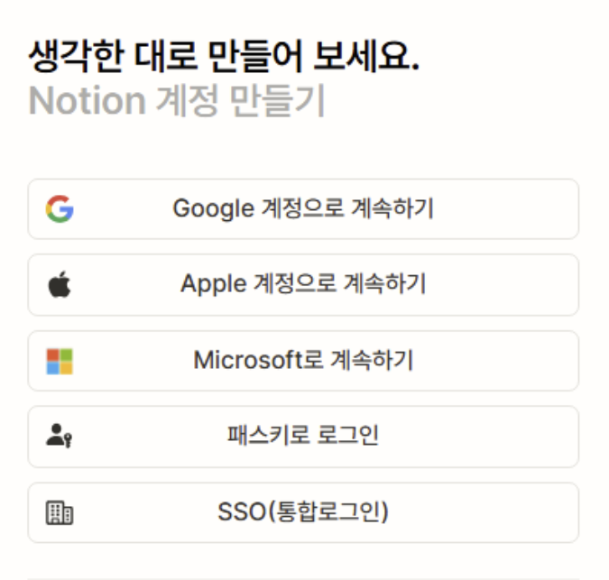

### 목차
- [OAuth(= Open Authorization) 란?](#oauth---open-authorization----)
  * [OAuth 1.0 vs OAuth 2.0](#oauth-10-vs-oauth-20)
  * [OAuth 사용 시나리오](#oauth--------)
    + [구성요소](#----)
    + [시나리오 설명](#-------)

# OAuth(= Open Authorization) 란?

암호와 같은 개인 정보를 유출하지 않고 한 앱 또는 서비스에서 다른 앱 또는 서비스에 로그인할 수 있는 권한을 부여할 수 있는 기술 표준

- 새 계정을 만들 필요 없이 다른 앱 서비스로 원활하게 연결할 수 있는 권한 부여
    - 액세스 토큰을 사용하여 ID를 증명하고 사용자 대신 다른 서비스와 상호 작용할 수 있음

## OAuth 1.0 vs OAuth 2.0

- OAuth 1.0: 웹 사이트에 대해서만 개발
- OAuth 2.0: 앱과 웹 사이트 모두를 위해 설계

## OAuth 사용 시나리오

### 구성요소

- **사용자**: 웹 애플리케이션을 이용하는 주체로, 자신의 사용자 정보 등 보호된 리소스에 대해 클라이언트가 접근할 수 있도록 동의할 권한을 가진 리소스 소유
- **웹 브라우저(chrome 등)**: 사용자와 상호작용하며 리다이렉트와 요청 전달을 담당하는 User Agent
    1. 웹앱 서버가 브라우저에 `302 Redirect → Microsoft/authorize` 요청 시 브라우저가 microsoft  로그인 페이지로 이동
    2. 로그인 성공 후 microsoft 서버가 `302 Redirect → 웹앱 redirect_uri` 요청 시 브라우저가 다시 웹앱으로 이동
- **웹앱(서비스 자체)**:
    - OAuth Client 역할: 인증을 위해 Authorization Code 요청
    - Resource Server 역할: 인증 완료 후 자체 서비스 리소스 제공
- **Microsoft Entra ID**: Microsoft Entra IDP(ID 공급자)라고도 하는 인증서버. 사용자의 정보, 액세스및 트러스트 관계와 관려이 있는 모든 작업을 안전하게 처리함. 리소스에 대한 액세스 권한을 부여하고 해지하는 토큰을 발급할 책임이 있음.

### 시나리오 설명

1.  사용자가 웹 애플리케이션에 접근 요청
    
    → 사용자가 브라우저로 노션 같은 웹앱에 접속
    
2. 웹 애플리케이션이 사용자를 Microsoft Entra ID(로그인 페이지)로 리다이렉트 함
3. 사용자가 Microsoft Entra ID 에서 인증 수행
    
    → 사용자가 Microsoft 로그인 화면에서 아이디/비밀번호 등으로 본인 인증
    
4. Microsoft Entra ID 가 사용자에게 동의 요청
    
    → “”이 앱이 네 정보에 접근해도 되냐고 물음
    
5. 사용자가 동의 승인
6. Microsoft Entra ID 가 Authorization Code 를 발급하고 사용자를 웹앱으로 리다이렉트
7. 웹 애플리케이션이 Authorization Code 를 사용해 Microsoft Entra ID 에 토큰을 요청
    - 이 통신은 브라우저 안거침
    - 서버 ↔ 서버 직접 통신
8. 웹 애플리케이션이 Microsoft Entra ID 로부터 access token / refresh token 을 수신하고 검증
9. 웹 애플리케이션이 보호된 리소스에 대한 접근 허용
    
    → 로그인된 사용자로 판단하고 서비스 기능과 데이터 접근 허용
    
- Authorization Code 란?
    - access token / refresh token 을 교환받기 위한 일회용 증표와 같음

---

참고자료

https://www.microsoft.com/ko-kr/security/business/security-101/what-is-oauth

https://learn.microsoft.com/ko-kr/entra/architecture/auth-oauth2

https://learn.microsoft.com/ko-kr/entra/identity-platform/v2-oauth2-auth-code-flow