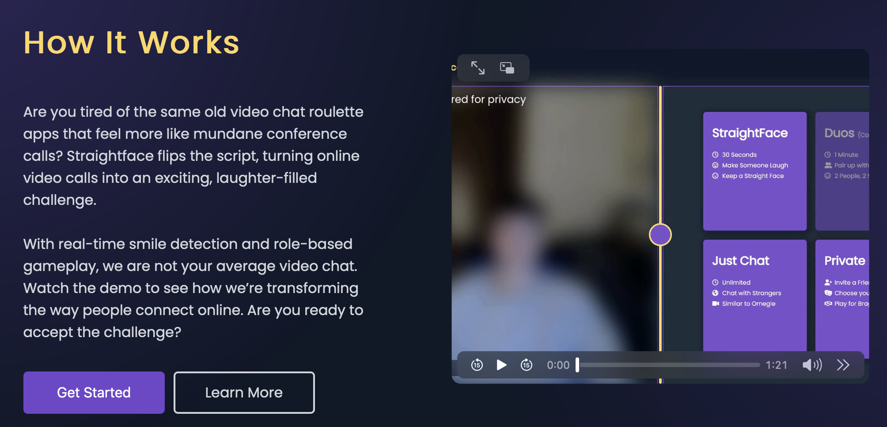

# 0. 개요(Overview)

본 시장 조사는 ‘웃으면 안된다’는 단순하고 직관적인 규칙을 핵심으로 하는 국내외 콘텐츠 및 서비스 사례를 분석하여, 해당 포맷이 가지는 시장성 및 구조적 한계를 파악하는 것을 목적으로 한다.

국내 유튜브 콘텐츠를 통해 해당 규칙이 시청형 엔터테인먼트로서 높은 몰입감과 대중적 인기를 확보했음은 확인되었으나, 이를 일반 사용자가 반복적으로 참여하는 게임형 서비스로 전환할 경우 심리적 진입 장벽, 안전성, 지속 사용성 측면에서 새로운 문제가 발생할 수 있음을 전제로 한다.

이에 본 조사는 시청형 콘텐츠와 참여형 서비스 간의 간극을 중심으로, 기존 유사 서비스들의 운영 방식과 실패 요인을 비교·분석하고, 그 결과를 바탕으로 본 프로젝트가 지향해야 할 차별화된 서비스 구조와 기획 방향에 대한 시사점을 도출하고자 한다.

---

# 1. 시장 환경 분석

## 1-1. 국내 웃으면 안되는 콘텐츠 트렌드

국내에서 웃으면 안된다는 명확한 규칙과 웃는 순가 발생하는 즉각적인 결과(패배)가 핵심 재미 요소인 유튜브 콘텐츠들 존재한다. 이러한 콘텐츠들은 복잡한 설명 없이도 규칙이 즉시 이해되어 참여에 부담이 없다는 특징이 있다.

### 1) 유병재 웃으면 안되는 생일파티(유튜브 콘텐츠)

- 100만 - 800만회 조회수 기록(2023 - 2025)
- 단발성 영상이 아닌 시리즈 형태로 반복 소비
- 단, 해당 콘텐츠의 높은 조회수에는 유명 출연진 효과가 작용했을 가능성이 큼.

### 2) 웃으면 강퇴당하는 방(유튜브 콘텐츠)

- 10만 - 300만 조회수 기록(2023)
- 단, 약 2년 전 큰 인기를 끌었던 콘텐츠로, 현재 시점에서 동일한 포맷이 지속적으로 확장되고 있다고 보기는 어려움.

## 1-2. 시청형 콘텐츠와 참여형 서비스의 간극

국내 유튜브 콘텐츠 사례를 통해 확인할 수 있듯이, 웃으면 안된다는 명확한 규칙과 즉각적인 패배 구조는 시청자 입장에서 높은 몰입과 긴장감을 유발하는 요소임이 검증되었다. 그러나 이러한 성과가 곧바로 참여형 게임 서비스에 대한 수요로 직결된다고 보기는 어렵다.

따라서 현재 시점에서는 이 포맷이 재미있다는 점은 충분히 증명되었으나, 일반 사용자가 반복적으로 참여할 게임이 될 수 있는가에 대해서는 추가적인 검증과 설계가 필요하다고 판단된다.

---

# 2. 경쟁 서비스 분석

웃음 또는 표정 반응을 게임 규칙으로 활용한 국내외 유사 서비스 및 콘텐츠를 분석하고, 각 서비스의 구조와 한계를 통해 본 프로젝트가 보완해야 할 점을 도출한다.

## 2-1. StraightFace(서비스 운영 중)

서비스 개요

StriaghtFace 는 온라인 영상 채팅 기반 웃음 경쟁 게임으로, 사용자는 상대방을 웃게 만드는 것을 목표로 실시간 대결을 진행한다.

게임 방법

- 온라인 게임으로, 사용자들은 GameCenter 를 통해 서로 연결됨
- 영상 채팅을 통해 상대방을 웃게 만들면 승리.
- 낯선 사람과 자동으로 매칭되는 straight face 게임모드 뿐만 아니라 친구를 초대하여 사용할 수 있는 private 모드, 게임이 아닌 낯선 사람과 화상 채팅 기능도 제공

기술적 특징

- 웃음 추적은 아이폰의 전면 TreuDepth 카메라를 사용하여 구현되었음.

참고사항

- 로그인: Google 또는 이메일로 회원 가입

참고링크: https://straightface.io/

## 2-2. Flinch (2015 - 공식 운영 종료로 추정)

서비스 개요

Flinch 는 2015년 출시된 영상 기반 웃음/표정 경쟁 앱으로, 영상 회의 기술을 활용해 사용자들을 무작위로 연결하는 구조를 채택했다.

게임 방법

- 먼저 미소를 짓거나, 웃거나, 혹은 flinch(얼굴이 흔들리거나 표정이 무너지는 것)를 보이는 사람이 패배.
- 친구와 플레이, 친구 만들기(무작위 매칭) 옵션 존재.

실패 원인 분석

1. 과도한 개인정보 노출 위험
    - 위치 정보를 켜면 무작위로 매칭된 사용자들이 상대방의 사용자명, 위치 추적 가능.
2. 무작위로 매칭 구조 남용
    - 범죄자가 표적에 접근하여 사이버 괴롭힘이 발생하기 쉬운 플랫폼이 될 수 있고, 이미 그러한 사례들이 있음.
    - 성적이나 불쾌한 행동 노출 가능

# 3. 정리 및 시사점

국내외 사례를 종합하면, 웃음 또는 표정 반응을 규칙으로 활용한 포맷 자체는 반복적으로 시도되었고, 단기적인 관심과 재미는 검증되었다.

그러나 기존 서비스들은 공통점으로 안전한 매칭 구조, 개인정보 보호, 반복 참여를 유도할 수 있는 설계 측면에서 한계를 보였다.

이는 본 프로젝트가 단순히 기존 포맷을 재현하는 것이 아니라, 참여 부담과 위험 요소를 완화하면서도 지속 가능한 게임 구조를 설계해야 할 필요성을 시사한다.

---
참고자료

https://www.businessinsider.com/flinch-is-a-staring-contest-app-2015-4?utm_source=chatgpt.com

https://www.mcafee.com/blogs/family-safety/why-the-new-flinch-app-is-far-from-family-friendly/
